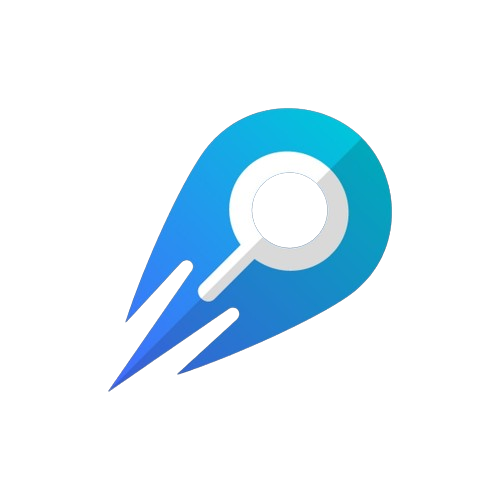

  <h1 style="text-align: center; font-weight: bold;">Insight Lab - Challenge</h1>
  
  <div style="display: flex; align-items: center; justify-content: center">
    
  </div>

<br>
<br>

## Sobre o Projeto ✨

A aplicação consiste basicamente em um sistema de gerenciamento de fornecedores para uma empresa.

### Tecnologias Usadas

- [React](https://reactnative.dev/)
- [Vite](https://expo.dev/)
- [TypeScript](https://www.typescriptlang.org/)
- [Tailwind](https://tailwindcss.com/)
- [Eslint](https://eslint.org/)
- [Json-Server](https://github.com/typicode/json-server)
- [Axios](https://axios-http.com/ptbr/docs/intro)
- [React Query](https://tanstack.com/query/latest/docs/framework/react/overview)
- [React Router](https://reactrouter.com/en/main)
- [React Hook Form](https://react-hook-form.com/)
- [Zod](https://zod.dev/)
- [Shadcn UI](https://ui.shadcn.com/)

### Como rodar a aplicação 🚀

```bash
# Clone este repositório
$ git clone https://github.com/marrcelosantana/challenge-insight
# Acesse a pasta do projeto
$ cd challenge-insight
# Instale as dependências
$ npm install
# Execute a aplicação
$ npm start

```

### LINKS 🔗

[Front-End em produção.](https://challenge-insight.vercel.app/)

[API em produção.](https://challenge-insight-api-3ed6399e7cfd.herokuapp.com/)


